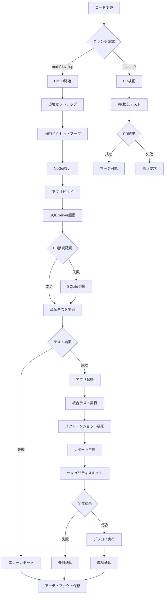
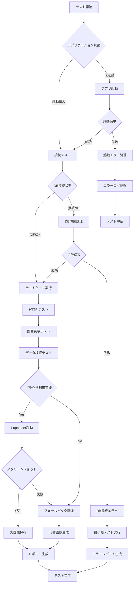
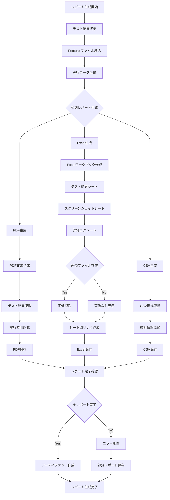
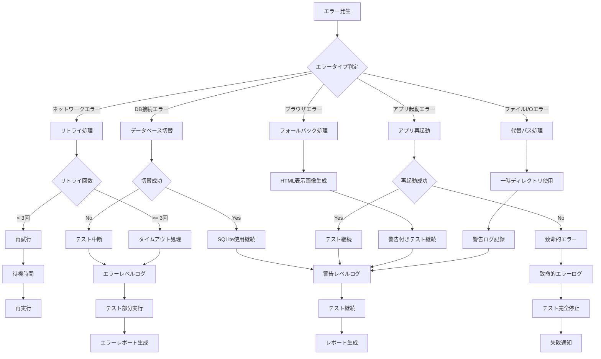
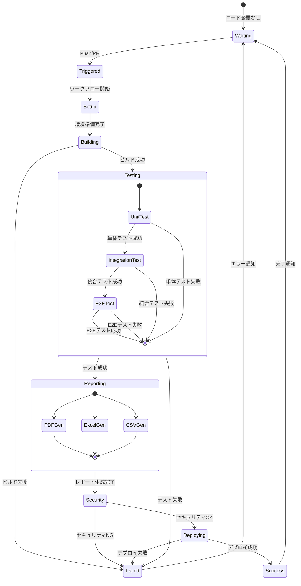

# テストフロー図 (Test Flow Charts)

## 1. 全体テストフロー

## 2. テスト実行決定フロー

## 3. レポート生成フロー

## 4. エラーハンドリングフロー

## 5. CI/CD パイプライン状態遷移

## フロー図の説明

### 主要な判定ポイント
1. **ブランチ判定**: main/develop vs feature branches
2. **アプリケーション状態**: 起動成功/失敗
3. **データベース接続**: SQL Server vs SQLite fallback
4. **ブラウザ可用性**: Puppeteer vs フォールバック
5. **テスト結果**: 成功/失敗/部分成功

### 並列処理ポイント
- レポート生成 (PDF, Excel, CSV)
- セキュリティスキャンとビルド
- 複数テストケースの実行

### フォールバック機構
- SQL Server → SQLite
- Puppeteer → HTML画像生成
- ネットワークエラー → リトライ
- ファイルI/O → 代替パス