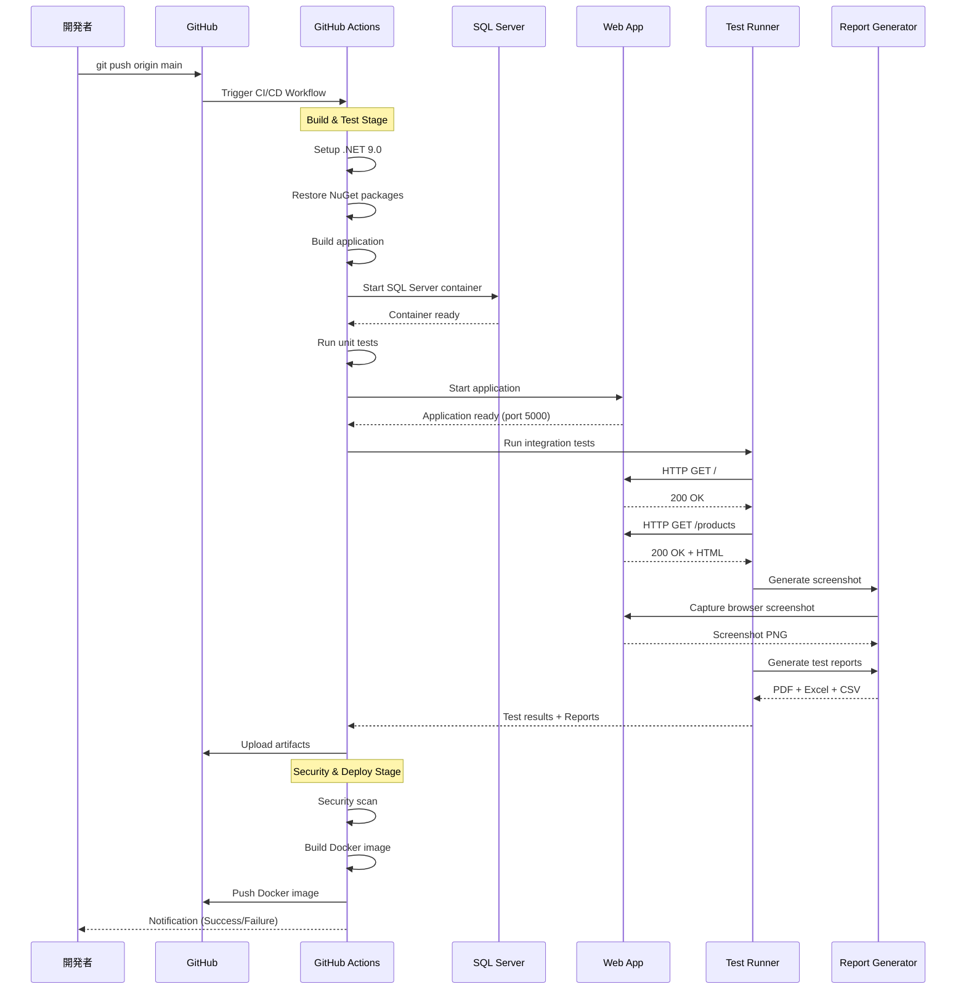
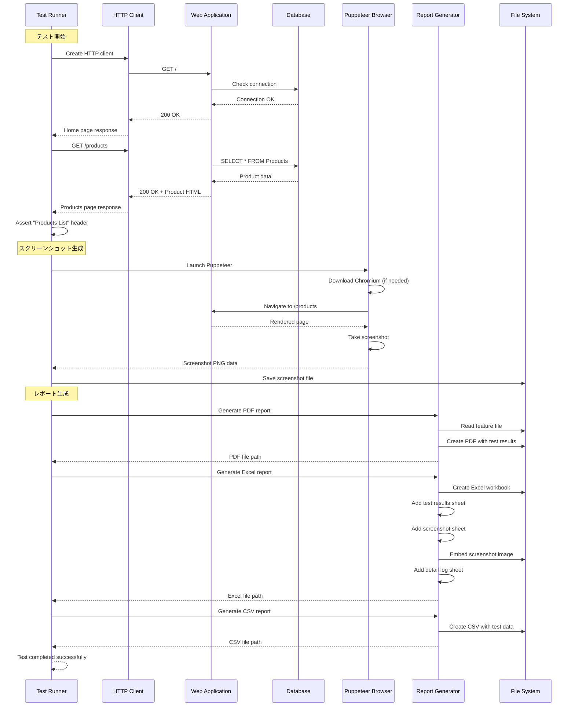
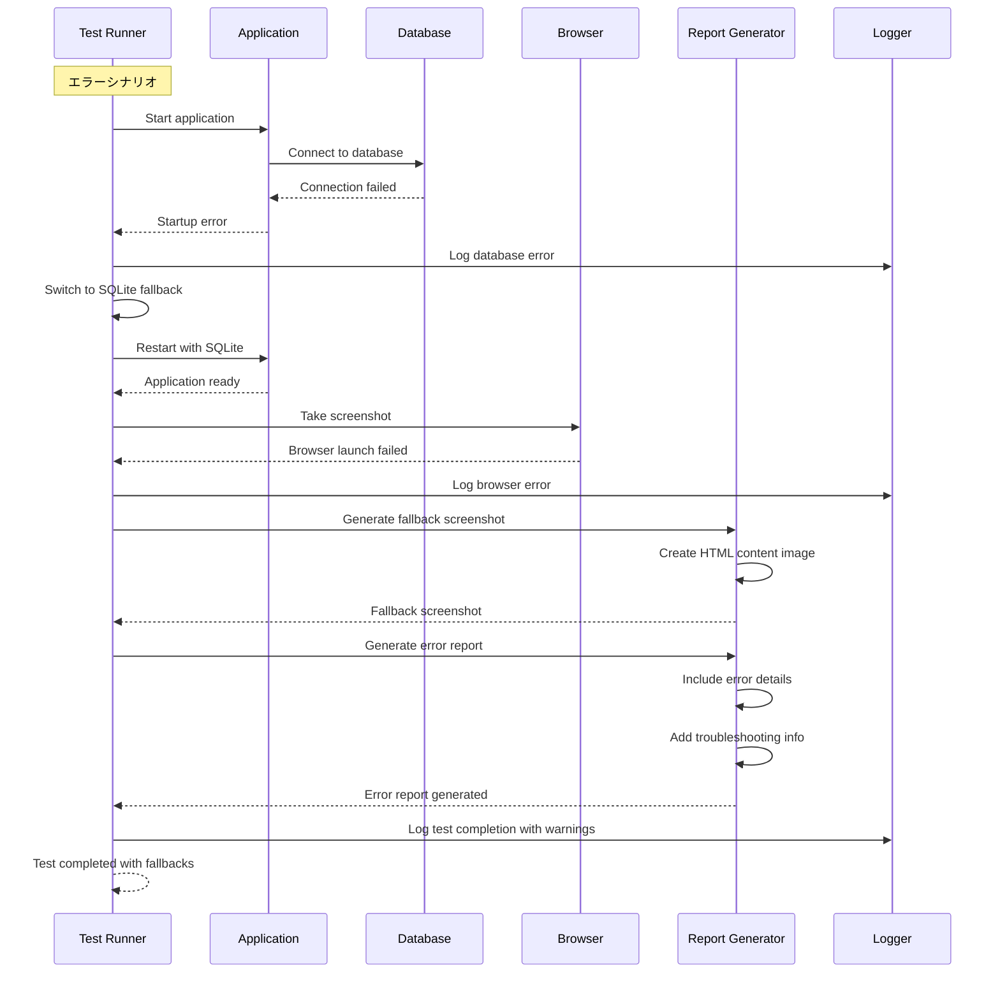
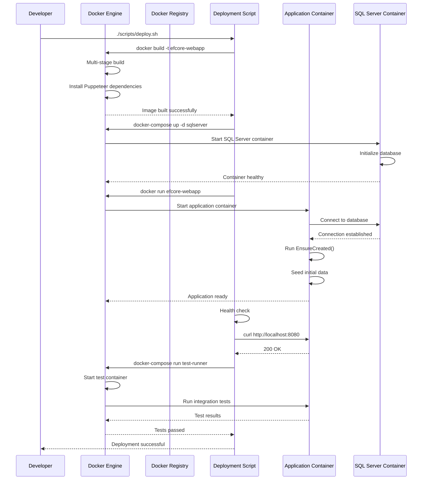

# テストフロー時系列図 (Test Sequence Diagrams)

## 1. CI/CD パイプライン全体フロー



## 2. 統合テスト詳細フロー



## 3. エラーハンドリングフロー



## 4. レポート生成詳細フロー

```mermaid
sequenceDiagram
    participant Test as Test Runner
    participant Excel as Excel Generator
    participant PDF as PDF Generator
    participant CSV as CSV Generator
    participant File as File System
    participant Feature as Feature File

    Note over Test: レポート生成開始
    Test->>Feature: Read feature file
    Feature-->>Test: BDD scenarios
    
    parallel
        Test->>PDF: Generate PDF report
        PDF->>PDF: Create document
        PDF->>PDF: Add test results
        PDF->>PDF: Add execution details
        PDF->>File: Save PDF file
        PDF-->>Test: PDF completed
    and
        Test->>Excel: Generate Excel report
        Excel->>Excel: Create workbook
        Excel->>Excel: Add "テスト結果" sheet
        Excel->>Excel: Format headers and data
        Excel->>Excel: Add "スクリーンショット" sheet
        Excel->>File: Embed screenshot image
        Excel->>Excel: Add "詳細ログ" sheet
        Excel->>Excel: Create hyperlinks between sheets
        Excel->>File: Save Excel file
        Excel-->>Test: Excel completed
    and
        Test->>CSV: Generate CSV report
        CSV->>CSV: Parse feature scenarios
        CSV->>CSV: Format test results
        CSV->>CSV: Add statistics
        CSV->>File: Save CSV file
        CSV-->>Test: CSV completed
    end
    
    Test->>File: Create test results directory
    Test->>File: Copy all report files
    Test-->>Test: All reports generated
```

## 5. Docker デプロイメントフロー



## フロー説明

### 主要なフェーズ
1. **準備フェーズ**: 環境セットアップ、依存関係解決
2. **ビルドフェーズ**: アプリケーションコンパイル
3. **テストフェーズ**: 単体・統合テスト実行
4. **レポートフェーズ**: 多形式レポート生成
5. **デプロイフェーズ**: コンテナ化とデプロイ

### 並列処理
- レポート生成は並列実行で効率化
- Docker ビルドとテスト実行の最適化
- 複数形式のレポート同時生成

### エラー回復
- データベース接続失敗時のSQLite切替
- ブラウザ失敗時のフォールバック画像
- ネットワークエラー時のリトライ機構